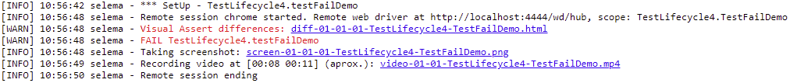

[](https://sonarcloud.io/summary/new_code?id=my%3Aselema)
[](https://search.maven.org/artifact/io.github.javiertuya/selema)
[](https://www.nuget.org/packages/Selema/)

# Selema - Selenium Test Lifecycle Manager

A multi-platform, multi-framework Selenium Test Lifecycle Manager on Java and .NET.
Automates the WebDriver instantiation and configuration, 
providing an unified test log, clues for debugging
and integration with CI platforms and Browser services.

- Support:
  - Platforms: Java (>=8) and .NET Core (>=3.1)
  - Test frameworks: JUnit 4, JUnit 5, NUnit 3, MSTest 2
  - CI/CD environments: Jenkins, GiHhub Actions
  - Browser services: Selenoid
- Features:
  - Transparent download/creation/disposal of the Selenium WebDriver
  - Configurable driver mode (per test, per class)
  - Unified log in html format
  - Take a screenshot when a test fails
  - Video recording and display a timestamp when test fails
  - Watermark with the test being executed and its status
  - Visual differences when comparing large strings (Visual Assert)
  - Flaky test handling (Retry failed tests) on all supported frameworks

# Getting started

On Java, include the `selema` dependency as indicated in
[Maven Central](https://search.maven.org/artifact/io.github.javiertuya/selema).
On .NET, include the `Selema` package in you project as indicated in
[NuGet](https://www.nuget.org/packages/Selema/)

Selema works around two main components: 
A `Lifecycle*` controller class that detects the events during the test lifecycle 
and calls the `SeleManager` to perform the required actions.

## Basic usage

To use Selema with your tests you only need:
- Instantiate a SeleManager object (`sm` in the examples).
- Configure the test class with a `Lifecycle*` annotation or rule (depending on the test framework).

The appropriate Selenium WebDriver will be instantiated and closed before and after test execution
and accesible to the tests using the `driver()` method (Java) or the `Driver` property (net).

Expand/collapse the below items for instructions and examples on each of the supported platforms.
[Full source of examples can be found here](samples):

<details open><summary><strong>JUnit 5</strong></summary>

(1) Extend the test class with a `@ExtendWith(LifecycleJunit5.class)` annotation
and (2) declare a static instance `sm` of `SeleManager`:

```
@ExtendWith(LifecycleJunit5.class)
public class TestSampleJunit5 {
	private static SeleManager sm=new SeleManager().setBrowser("chrome");
	@Test
	public void testFailMethod() {
		sm.driver().get("https://en.wikipedia.org/");
		assertEquals("XXXX Wikipedia, the free encyclopedia", sm.driver().getTitle());
	}
}
```

</details>

<details><summary><strong>JUnit 4</strong></summary>

Declare (1) a static instance `sm` of `SeleManager`
and (2) a `LifecycleJunit4Test` rule receiving `sm` as argument

```
public class TestSampleJunit4 {
	private static SeleManager sm=new SeleManager().setBrowser("chrome");
	@Rule public LifecycleJunit4Test tw = new LifecycleJunit4Test(sm);
	@Test
	public void testFailMethod() {
		sm.driver().get("https://en.wikipedia.org/");
		assertEquals("XXXX Wikipedia, the free encyclopedia", sm.driver().getTitle());
	}
}
```

NOTE: If SeleManager is confgured to manage one driver per class (see below) 
an additional rule must be declared just after SeleManager instantiation:

```
	@ClassRule public static LifecycleJunit4Class cw = new LifecycleJunit4Class(sm);
```

</details>

<details><summary><strong>NUnit 3</strong></summary>

Declare (1) an instance `sm` of `SeleManager`
and (2) a decorate the test class with the `[LifecycleNunit3]` annotation:

```
    [LifecycleNunit3]
    public class TestFailedExample
    {
        protected SeleManager sm = new SeleManager().SetBrowser("chrome");
        [Test]
        public void TestFailMethod()
        {
            sm.Driver.Url = "https://en.wikipedia.org/";
            Assert.AreEqual("XXXX Wikipedia, the free encyclopedia", sm.Driver.Title);
        }
    }
```

</details>

<details><summary><strong>MSTest 2</strong></summary>

Declare (1) a static object `sm` of `SeleManager`, (2) instantiate `sm` in the class constructor
and (3) inherit the test class from `LifecycleMstest2`. 
See comments in the example for additional explanations:

```
    [TestClass]
    public class TestFailedExample : LifecycleMstest2
    {
        protected static SeleManager sm;
        public TestFailedExample()
        {
            sm = LifecycleMstest2.GetManager(sm).SetBrowser("edge");
        }
        //Note that due to the extensibility restrictions of MSTest, the test class must inherit the Lifecycle class.
        //Additionally the instantiation and configuration is made in the class constructor,
        //Method GetManager ensures that there is a unique sm instance in the class and is bound to the Lifecycle class.
        //Instantiation can be done in ClassInitialize as shown in the full example

        [TestMethod]
        public void TestFailMethod2()
        {
            sm.Driver.Url = "https://en.wikipedia.org/";
            Assert.AreEqual("XXXX Wikipedia, the free encyclopedia", sm.Driver.Title);
        }
    }
```

</details>

## Log files

Test execution produces an html log file `selema-log.html` in the `target` folder (on Java) or `reports` folder (on .NET) 
with links to screenshots taken when some test fails, difference files and videos. 
Log info is also sent to the configured application logger (if any): slf4j on Java and NLog on .NET.



# Basic configuration

Basic configuration is made using setter methods on the SeleManager instance. 
All `set*` methods follow a fluent style, so they can be concatenated in a single statement.

NOTE: The below sections use the the Java syntax. 
Unless otherwise stated, on .NET, all packages, classes and methods have the same names than on Java, but package and methods names are capitalized.

## Driver management

- **Browser**: `setBrowser(String browser)` sets the WebDriver for the specified browser ("chrome", "firefox", "edge", "safari", "opera"), default is chrome.
- **Drivers**: `setDriverUrl(String driverUrl)` sets a RemoteWebDriver instead a local one (default). The driverUrl must point to the browser service.
- **Modes of Operation**: By default, Selema starts a WebDriver before each test executions and quits after each test execution, but this behaviour can be modified:
  - `setManageAtClass()`: Starts a WebDriver before the first test at each class, and quits after all tests in the class
  - `setManageNone()`: Do not start/quit automatically any webdriver. Useful to test scenarios that involve users closing browsers.
    If needed, tester can instantiate and close a driver by calling `createDriver()` and `quitDriver(WebDriver driver)` on the SeleManager Instance.
    Method `hasDriver()` indicates if an instance of the driver has been created (accesing a non instantiated driver thwows an exception).
  - `setManagedAtTest()`: Returns to the default behaviour.
- **WebDriver Capabilities (options)**: `setOptions(Map<String,Object> options)` adds the specific capabilities to the WebDriver prior to its creation.
- **WebDriver Arguments**: `setArguments(String[] arguments)` adds the specific arguments to the WebDriver execution. 
  For example, use `setArguments(new String[] {"--headless"})` to run the browser in headless mode

## Log file location

Default location of selema log file and log file name can be overriden by pasing a `SelemaConfig` instance as argument at the SeleManager instantiation. 
`SelemaConfig` admits the following fluent style customization methods:

- `setReportSubdir(String subdir)`: changes the name of the report folder (relative to the project root). Default is `target` (on Java) and `reports` (on .NET).
- `setProjectRoot(String root)`: changes the location of the project root. 
  Default is `.` on Java and `../../../..` on .NET (this is the solution folder provided that the test project is located just below the solution folder).
- `setName(String name)`: changes the name of the log and the log file. Useful when you need to separate logs in different files.

For instance, `new SeleManager(new SelemaConfig().setReportSubdir("target/site").setName("custom"))` 
instantiates a SeleManager that places the reports in the `target/site` folder 
and produces a log file named `selema-custom-log.html`.

## Delegated configurations

Additional or new configurations can be delegated to an tester suplied object that implments a given interface
and establishes these configurations in its `configure` method:

- `setManagerDelegate(IManagerConfigDelegate configDelegate)`: Sets a delegate that executes the configuration actions specified in the `configure` method
  at the Selenium Manager instantiation.
  Useful when same configuration is made on multiple test classes, or configuration is complex, maybe read from a properties file.
- `setDriverDelegate(IDriverConfigDelegate driverConfig)` Sets a delegate that executes the configuration actions specified in the `configure` method
  just after each driver is created.

# Advanced configuration and services

Most of actions performed by the SeleManager instance are implemented as services that are attached to the instance using a set of overloaded `add` methods. 
Some services are predefined (attached during the SeleManager instantiation) 
and others are optional (attached by calling to `add(<service-instance>)` on the SelenimManager instance). 
All `add` methods and service configuration methods follow a fluent style.

## Watermark service

Inserts a text at the top left side of the browser with the name of test being executed and the failure status. 
Use `add(new WatermarkService())` to attach an instance. The service instance can be cusomized with these methods:
- `setDelayOnFailure(int delayOnFailure`): After a test failure, waits for the specified time in seconds to give more time to watch the state of the browser (interactively or in a video).
- `setBackground(String color)`: Sets a background color to better differentiate the watermark from the web content (by default watermark has no background).

Watermarks are automatically inserted after a test fails.
Additional watermark with the test name can be inserted by the tester using the `watermark()` method of the SeleManager instance (tipically just after moving to an url). 
During test execution the user can also write arbitrary text using the `watermarkText(String value)` method.

## Browser service (Selenoid)

Use `add(new SelenoidService())` to attach an instance that allows integrate and configure [Selenoid](https://aerokube.com/selenoid/latest/), 
in particular, recording videos of each driver session. 
The Selenoid service instance can be cusomized with these methods:
- `setVideo()`: Activates the video recording, provided that the Selenoid server is 
  properly [configured for video recording](https://aerokube.com/selenoid/latest/#_video_recording)
- `setVnc()`: Activates the VNC capabilities to be able to watch the test execution in real time (e.g. using selenoid-ui). 
  Note that Selenoid requires special driver containers to allow this capability.

To use a remote driver the driver url must be configured by calling `setDriverUrl(String driverUrl)` on the SeleManager instance.

An example of a Selenoid set up accesible from the `http://localhost:4444/wd/hub` url is shown below:

```
# Creates the required browser configuration file and required folders that will be mapped in the containers
mkdir -p target/browsers
echo '{"chrome": {"default": "latest", "versions": {"latest": {"image":"selenoid/chrome:latest","port":"4444","tmpfs": {"/tmp":"size=512m"} } } } }' > target/browsers/browsers.json
mkdir -p target/video

# Downloads images and lauch selenoid container (project root is $GITHUB_WORKSPACE)
docker pull selenoid/chrome:latest
docker pull selenoid/video-recorder:latest-release
docker run -d --name selenoid -p 4444:4444 \
  -v /var/run/docker.sock:/var/run/docker.sock -v $GITHUB_WORKSPACE/target/browsers:/etc/selenoid/:ro \
  -v $GITHUB_WORKSPACE/target/site/video/:/opt/selenoid/video/ -e OVERRIDE_VIDEO_OUTPUT_DIR=$GITHUB_WORKSPACE/target/video/ \
  aerokube/selenoid:latest-release
```

Recorded videos are linked to the Selema log. 
When a test fails a timestamp of the approximate time in which the filure appeared is included (useful when using a single web driver session for all tests in a class).

## Browser service (Selenium Server)

(Planned)

## Javascript coverage service (JSCover)

Use `add(JsCoverService.getInstance(<instrumented-root-url>))` to attach an instance that allows integrate and configure [JSCover](http://tntim96.github.io/JSCover/) 
to measure javscript coverage:

- When executing the instrumented javascript code, coverage is stored in the browser local memory
- Each time that a driver is open, the previously recorded coverage is loaded to the browser local memory (except first time that it is reset)
- Before closing each driver, the coverage is saved from browser local memory to file storage (`jscover.json' file)

Important notes:

- The service instance has to be instantiated as a singleton by `JsCoverService.getInstance`.
- The javascript code has to be preveviously instrumented using JSCover. The `<instrumented-root-url>` parameter indicates the designated root for all html and js files.
- And additional html file [jscoverage-restore-local-storage.html](java/src/main/resources/jscoverage-restore-local-storage.html) provided by 
  must be added to the instrumented root url to allow restoring coverage between sessions.
- This integration has been tested with JSCover version 2.0.6 and instrumented in [File Mode](http://tntim96.github.io/JSCover/manual/manual.xml#fileMode).

## Predefined services

- **CI/CD Services**: `ICiService` defines this interface. 
  At the instantiation, the SeleManager detects if tests are running under one of the recognized CI platforms and attaches the corresponding service instance. 
  Method `getCiService()`  retrieves the attached service, allowing access to a number of methods useful to perform conditional actions depending on the run platform:
  - `isLocal()`: Returns true if tests are not running in any of the recognized CI platforms.
  - `getName()`: Returns the name of the platform (local for local mode, jenkins pr github)
  - `getJobId()`: Returns an unique job identifier including the build number.
  - `getJobName()`: Returns the job identifier without the build number.
- **Screenshot service**: To take screenshots of the browser state and place the picture accesible from the log. 
  Usually, the tests do not access directly to this service, but can use the `screenshot(String fileName)` method on the SeleManager instance to take a picture at any time.
- **Visual Assert service**: To compare large strings. Places an html file with the differences accesible from the log.
  - The Methods `visualAssertEquals(...)` can be invoked on the SeleManager instance to perform the assert on the strings.
  - See the [Visual Assert documentation](https://github.com/javiertuya/visual-assert) for more information.
- **Soft Assert service**: A variant of Visual Assert that implements soft assertions.
  - The methods `softAssertEquals(...)` that fail record the message and the diff files instead of throwing an exception.
  - Method `softAssertAll()` must be called at the end of each test to cause an exception to be thrown including all assertion messages
    (if one or more assertions failed).
  - Method `softAssertClear()` must be called at the beginning of each test to reset the assertion messages of the Selenium Manager instance.

# Handling flaky tests

A common approach to mitigate the problem of flaky tests is to retry the test execution until test passes or a maximum number of retries. 
Support for this feature is managed differently (or not managed at all) by the test frameworks. 
Selema includes the required support on all supported frameworks. [See examples on each platform here](samples).

- **JUnit 5**: Declare the [rerunner-jupiter](https://search.maven.org/artifact/io.github.artsok/rerunner-jupiter) dependency
  and set the annotation `@RepeatedIfExceptionsTest(repeats = <repetitions>)` to the appropriate tests.
  Note that you **MUST NOT** add the `@Test` annotation.
- **JUnit 4**: Selema provides a custom rule implementation. 
  After declaring rules for the selenum manager, delcare a new instance of rule class `RepeatedTestRule` 
  and add the annotation `@RepeatedIfExceptionsTest(repeats = <repetitions>)` to the appropriate tests.
  Note that you **MUST** add the `@Test` annotation.
- **NUnit 3**: Use the native `Retry` annotation. Add the annotation `[Retry(<repetitions>)]` to the appropriate tests.
- **MSTest 2**: Selema provides a custom implementation. 
  Replace the `[TestMethod]` annotation by `[RetryTestMethod(<repetitions>)]` in the appropriate tests.
